# Database Schema (Alembic head `012`, 38 tables)

Conventions: UUID primary keys (`id`, except `ticket_counters`); `created_at/
updated_at` timestamps; enums for roles/statuses; pgvector `Vector(384)` for
embeddings; `vector` extension enabled by migration `002`.

## Authentication
- **users** — accounts. PK `id`. Unique `email`. FKs: none inbound-critical.
  Key columns: `role` (ADMIN/REPORTER/SOLVER/MENTOR), `password_hash` (bcrypt
  `$2b$`), `is_active`, `is_verified`.
- **refresh_tokens** — rotating refresh sessions. FK `user_id → users`
  (CASCADE). `token_hash` stored (never plaintext), `expires_at`, `revoked_at`.

## Users / profiles / skills
- **student_profiles** — one per solver/reporter. FK `user_id → users` (unique).
  Unique `student_identifier`. Workload: `current_workload/max_workload`.
- **faculty_profiles** — one per mentor. Unique `employee_identifier`;
  `specialization` drives mentor ranking. Same workload columns.
- **skills** — 46-row taxonomy. Unique `normalized_name`. `category`, `is_active`.
- **user_skills** — level per user. FKs → users, skills. `proficiency_level`,
  `is_verified`.
- **skill_embeddings** — MiniLM 384-d per skill. FK → skills; unique
  (skill, version). Index on `skill_id`.

## Problems
- **problems** — the report. Unique `ticket_number` (`CX-YYYY-NNNNNN` from
  **ticket_counters**). FK `reporter_id → users`. Status enum
  (SUBMITTED/UNDER_REVIEW/APPROVED/REJECTED/ASSIGNED/IN_PROGRESS/
  AWAITING_VERIFICATION/RESOLVED/CLOSED/DUPLICATE). AI snapshot columns
  (`predicted_category`, `classification_confidence`, `priority_*`,
  `*_status`), `canonical_problem_id` (self-FK, duplicate members),
  `reviewed_by/approved_by`, `rejection_reason`, `progress_percent`.
- **problem_attachments** — FK → problems (CASCADE). Unique `stored_filename`;
  `mime_type`, `size_bytes`, `uploaded_by`.
- **problem_comments** — reporter-visible comments + internal workspace
  discussion. FKs → problems (CASCADE), author → users. `is_internal`.
- **problem_activities** — audit trail. FK → problems (CASCADE).
  `event_type`, old/new status, message.

## AI analyses (append-only histories; latest row is current)
- **problem_classifications** — FK → problems (CASCADE). `predicted_category`,
  `confidence`, `model_name/version`, `status`
  (OK/LOW_CONFIDENCE/FAILED), `requires_manual_review`, `final_category` +
  `reviewed_by/at`, `review_note`.
- **problem_priority_analyses** — score 0–100, `priority_level`, five
  `*_component` columns + `component_details` jsonb, `algorithm_version`,
  `recalculation_reason`.
- **problem_skill_analyses** — run header (`model/version`, `status`).
- **problem_required_skills** — FKs → analysis, problem, skill.
  `score`, `match_type` (EXACT/HYBRID/SEMANTIC), `reason`.
- **problem_embeddings** — MiniLM 384-d of report text. FK → problems
  (CASCADE); unique (problem, version). `source_text_hash` for staleness.

## Duplicates
- **problem_duplicate_candidates** — one directed suggestion. FKs
  source/candidate → problems (CASCADE). `semantic_similarity`,
  `location_score`, `category_support_score`, `final_match_score`,
  `decision_status` (PENDING/CONFIRMED/REJECTED), reviewer + note.
- **duplicate_clusters** — `cluster_number` (`DC-NNNN`, unique, nullable),
  `canonical_problem_id → problems` (**SET NULL** on delete — can leave a
  hollow shell; analytics counts only membered clusters).
- **duplicate_cluster_members** — FKs → clusters (CASCADE), → problems
  (CASCADE). `is_canonical`, `confirmed_by`.

## Recommendations (advisory runs, history preserved)
- **team_recommendations** — per-problem run: component scores
  (`skill_coverage/proficiency/availability/workload/verified_skill/domain`),
  `coverage_percent`, `team_size`, `status`, `missing_skills` jsonb.
- **team_recommendation_members** — FKs → recommendation (CASCADE), → users.
  `individual_score`, `covered_skills`/`reason_data` jsonb.
- **mentor_recommendations** — FKs → problems, `mentor_user_id → users`.
  `specialization/skill_match/category/availability/workload` scores +
  `semantic_similarity`, `reason_data` jsonb.

## Assignment
- **problem_teams** — FK → problems (CASCADE). `name`, `is_active`.
- **problem_team_members** — FKs → teams (CASCADE), → users.
  `role_in_team`, `removed_at`, `is_active` (unassign = deactivate).
- **problem_assignments** — FKs → problems/teams (CASCADE), mentor → users,
  optional source recommendation FKs. `team/mentor_was_overridden` +
  reasons, `status` (ACTIVE/CANCELLED/…), unassignment audit columns.

## Workspace
- **problem_tasks** — FKs → problems/teams (CASCADE), assignee/creator →
  users. Status TODO/IN_PROGRESS/BLOCKED/DONE (strict transitions),
  `blocker_reason`, `priority`, `due_date`, timestamps incl. started/completed.
- **problem_milestones** — FK → problems (CASCADE). Status flow + target/
  completed dates.
- **problem_progress_updates** — FKs → problems (CASCADE), author → users.
  Summary/details/blockers/next-steps + `progress_snapshot`.
- **problem_work_attachments** — evidence files. FKs → problems (CASCADE),
  task, uploader. `is_reporter_visible=false` default (privacy),
  `is_knowledge_shareable` gates KB evidence.

## Solutions / verification
- **problem_solution_submissions** — append-only revisions (`revision_number`
  unique per problem). FKs → problems/assignment (CASCADE), submitter.
  Summary/root-cause/work/testing/notes/limitations, `evidence_attachment_ids`
  jsonb, readiness gate fields, `status`.
- **mentor_solution_reviews** — FK → submission (CASCADE), mentor → users.
  `decision` (APPROVED/CHANGES_REQUESTED) + comment.
- **problem_resolution_verifications** — FKs → problems (CASCADE),
  submission, reporter. `decision` (RESOLVED/NOT_RESOLVED) + reason.

## Notifications
- **notifications** — FK `recipient_user_id → users` (CASCADE);
  `problem_id → problems` (**CASCADE** — deleting a problem removes its
  notifications). `type`, title/message, `related_entity_*`, `read_at`.
  Indexes on (recipient, created) and `problem_id`.

## Knowledge
- **knowledge_entries** — published snapshot of a closed problem. FK
  `problem_id → problems` (CASCADE), unique. `public_id` (`KB-NNNNNN`,
  entry_number), problem/solution summaries, root cause, testing, team/mentor
  names (no reporter identity/email), `publication_status`
  (PUBLISHED/FAILED/ARCHIVED), `source_solution_submission_id`.
- **knowledge_embeddings** — MiniLM 384-d per entry (CASCADE).
- **knowledge_entry_skills** — skill links with `relevance_score`.

## Migration chain (all applied from scratch in Step 17 on a fresh DB)

001 initial → 002 users/profiles/skills (+`CREATE EXTENSION vector`) →
003 authentication → 004 problem reporting → 005 AI classification →
006 priority+skills → 007 duplicate detection → 008 recommendations →
009 assignment workflow → 010 tasks/progress → 011 notifications/verification →
012 knowledge repository. Single head `012`; no branches.

## ER diagram (major relationships)

```mermaid
erDiagram
    User ||--o{ StudentProfile : has
    User ||--o{ FacultyProfile : has
    User ||--o{ UserSkill : has
    Skill ||--o{ UserSkill : assigned
    Skill ||--o{ SkillEmbedding : embedded
    User ||--o{ Problem : reports
    Problem ||--o{ ProblemAttachment : has
    Problem ||--o{ ProblemComment : has
    Problem ||--o{ ProblemClassification : classified
    Problem ||--o{ ProblemPriorityAnalysis : scored
    Problem ||--o{ ProblemRequiredSkill : needs
    Problem ||--o{ ProblemEmbedding : embedded
    Problem ||--o{ ProblemDuplicateCandidate : suggests
    DuplicateCluster ||--o{ DuplicateClusterMember : contains
    Problem ||--o{ DuplicateClusterMember : member_of
    Problem ||--o{ TeamRecommendation : ranked
    TeamRecommendation ||--o{ TeamRecommendationMember : includes
    Problem ||--o{ MentorRecommendation : ranked
    Problem ||--o{ ProblemTeam : worked_by
    ProblemTeam ||--o{ ProblemTeamMember : includes
    Problem ||--o{ ProblemAssignment : assigned
    Problem ||--o{ ProblemTask : tracked_by
    Problem ||--o{ ProblemMilestone : planned_by
    Problem ||--o{ ProblemSolutionSubmission : solved_by
    ProblemSolutionSubmission ||--o{ MentorSolutionReview : reviewed
    Problem ||--o{ ProblemResolutionVerification : verified
    User ||--o{ Notification : receives
    Problem ||--o{ KnowledgeEntry : publishes
    KnowledgeEntry ||--o{ KnowledgeEmbedding : embedded
```

