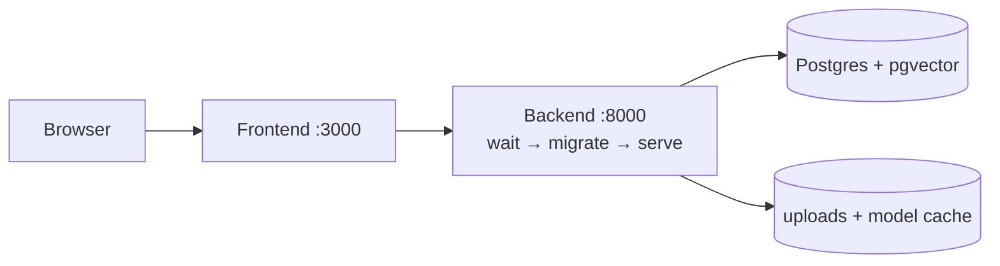

# Deployment Summary (evaluator version of `STEP_17_DEPLOYMENT.md`)

Architecture: browser → Next.js standalone (:3000) → FastAPI (:8000) →
Postgres 16 + pgvector; local volumes for uploads + HF model cache; 256 MB
DistilBERT weights mounted (gitignored). Same-parent-domain hosting
recommended (refresh cookie is `SameSite=Lax`).

Verified locally ( Step 17 ): images built (backend 2.97 GB, frontend
226 MB); `docker compose -f docker-compose.prod.yml up` → healthy prod backend
+ frontend; register/report/AI/knowledge/session flows pass; upload + DB row
survive restart; fresh-DB 001→012 migration proven. **No external live
deployment was performed** (no credentials provided) — readiness, not hosting,
is the claim. Backups via `pg_dump` verified read-only. Limits: single
instance (memory limiter), S3/Redis/SSO not built, HTTPS assumed in prod.
