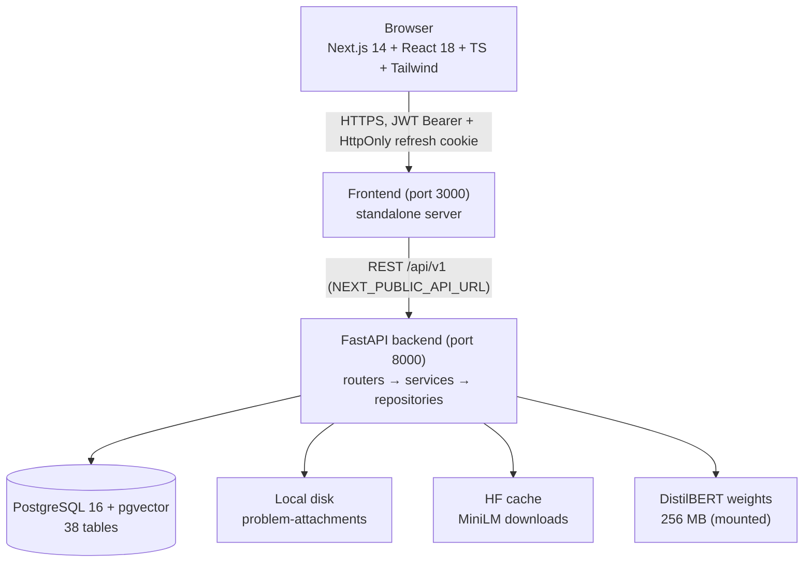
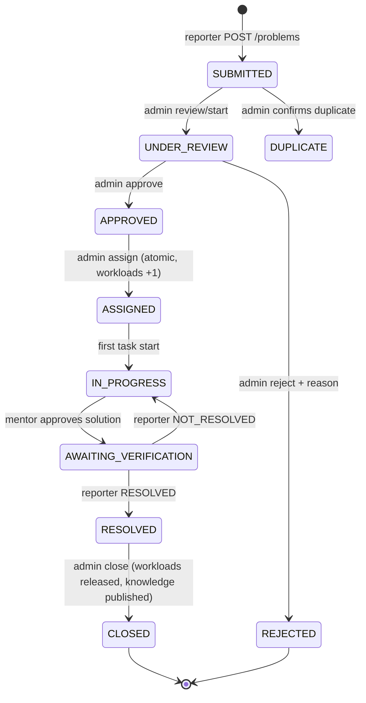
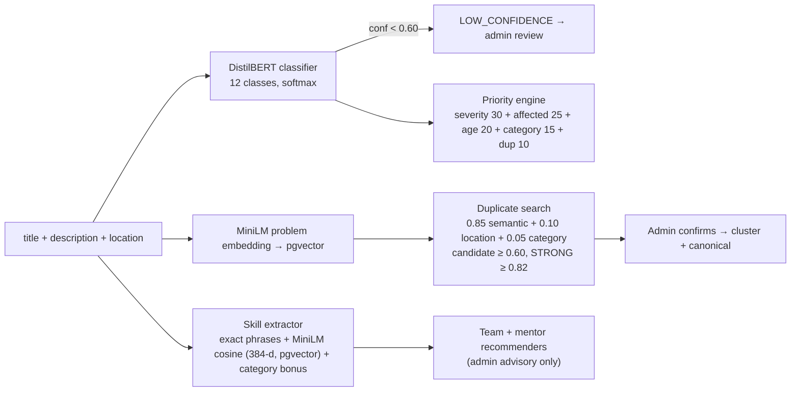
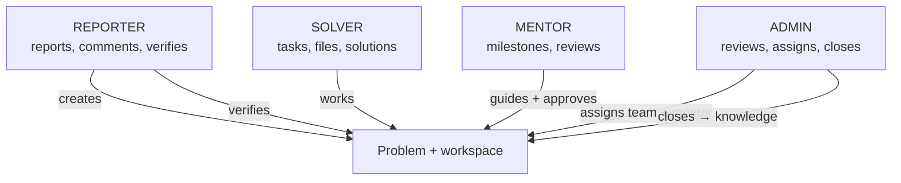
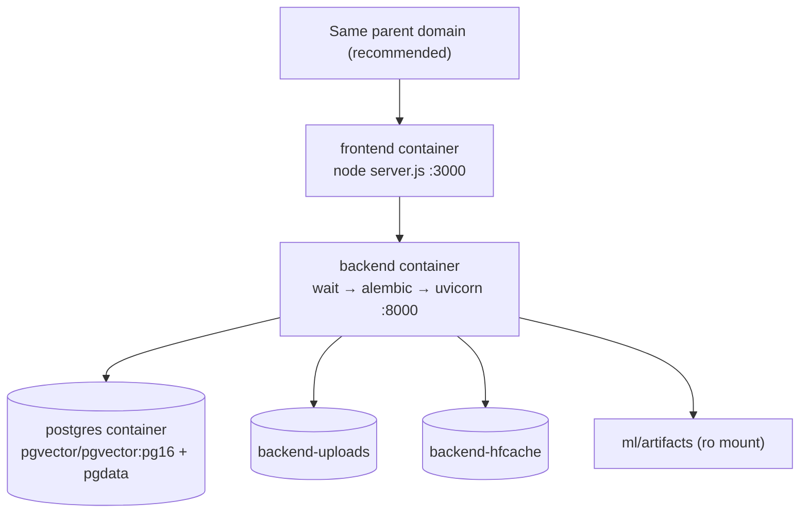

# Final Architecture

## High-level system architecture

## Complete report lifecycle

## AI/ML processing pipeline (on report creation)

## Role interaction

## Deployment architecture

## Data flow (browser → API → DB → AI)

1. Browser (axios + in-memory access token, HttpOnly refresh cookie) calls
   `NEXT_PUBLIC_API_URL/api/v1/...`.
2. Middleware: request ID → security headers → in-memory rate limit → CORS → JWT auth → RBAC guard.
3. Service layer runs business rules + AI (classifier/priority/skills/
   embeddings/recommenders), appending audit rows rather than overwriting.
4. Repositories persist via SQLAlchemy 2.0 async to Postgres; vectors via pgvector.
5. Responses are role-filtered (reporter-safe views strip IDs/internals).

## Layers

- **Frontend**: Next.js 14 App Router, React 18, TypeScript (strict), Tailwind,
  axios client with single-flight token refresh. 22 routes.
- **Backend**: FastAPI, Pydantic v2 (+ settings with prod fail-fast),
  SQLAlchemy 2.0 async, Alembic (001→012). Layering: `api` → `services` →
  `repositories` → `models`. 94 routes.
- **Database**: PostgreSQL 16 + pgvector extension (migration 002); 38 tables;
  UUID PKs; `ticket_counters` for `CX-YYYY-NNNNNN`.
- **AI/ML**: DistilBERT fine-tune (local), all-MiniLM-L6-v2 sentence embeddings
  (384-d), deterministic priority weights, heuristic recommenders — all behind
  human-in-the-loop gates.
- **Storage**: local-disk adapter (`storage/problem-attachments`), swappable.
- **Auth**: bcrypt `$2b$`, JWT access (30 min) + rotating opaque refresh
  (HttpOnly cookie, 7 d), RBAC roles, 404-masked IDOR.
- **Notifications**: in-app, typed, read-state tracked.
- **Docker**: prod images + compose with health-gated startup (see
  `docs/STEP_17_DEPLOYMENT.md`).
